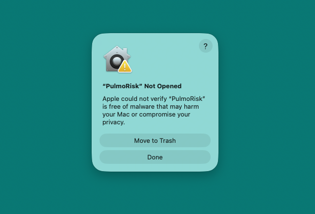
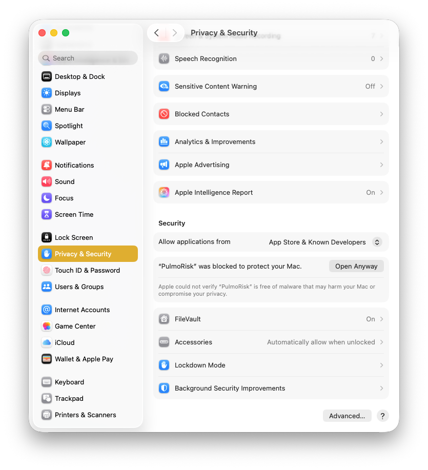
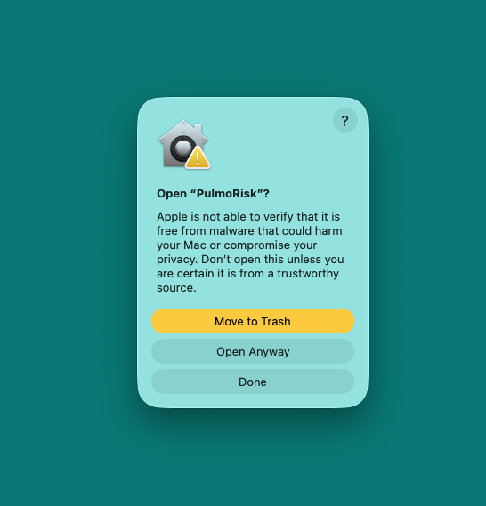

# PulmoRisk

A desktop application for lung cancer risk estimation, combining validated deep learning and radiomics models with clinical and epidemiological risk factors.


[](https://www.gnu.org/licenses/gpl-3.0)

[](https://github.com/hung-lab/Lung_cancer_risk_models/releases/latest)

**[⬇ Download the latest release](https://github.com/hung-lab/Lung_cancer_risk_models/releases/latest)**

---

## About

PulmoRisk is a clinical decision support tool for estimating lung cancer risk from low-dose CT (LDCT) scans combined with patient clinical and epidemiological data. It integrates two complementary validated machine learning models into a single desktop application:

**Sybil-Epi** — A lung cancer risk prediction model that combines Sybil's deep learning CT analysis with 11 clinical and epidemiological factors: age, BMI, education level, ethnicity, COPD history, family lung cancer history, personal cancer history, smoking status, smoking duration, smoking intensity, and smoking quit time. The model outputs a calibrated 6-year lung cancer risk probability. No nodule annotation or segmentation is required. More information: [journal.chestnet.org](https://journal.chestnet.org/article/S0012-3692(26)00296-5/fulltext) | [GitHub](https://github.com/hung-lab/Sybil-Epi)

**INTEGRAL-Radiomics** — A radiomic feature extraction model that quantifies imaging biomarkers from CT scans, providing a complementary malignancy risk estimate based on tumour texture, shape, and intensity patterns. Requires a CT image and nodule mask in NRRD format. [GitHub](https://github.com/hung-lab/INTEGRAL-Radiomics)

> ⚠️ This tool is intended for research and clinical decision support only. Results should be interpreted by a qualified clinician and do not constitute a diagnosis.

---

## Features

- 🫁 **Two validated models** — Sybil-Epi (CT + clinical) and INTEGRAL-Radiomics (CT + radiomics)
- 📋 **Single patient and batch modes** — run one patient at a time or process a CSV of patients
- 🔄 **Automatic R setup** — INTEGRAL-Radiomics R dependencies install automatically on first launch
- 🪵 **Live activity log** — real-time inference progress and logging panel
- 🌗 **Light / Dark / System theme** — accessible contrast theme with full dark mode support
- 🐍 **uv package manager** — fast and reproducible dependency management
- 🐳 **Docker development** — containerised environment with docker-compose
- 🚀 **GitHub Actions CI/CD** — automated testing, linting, and multi-platform releases
- 🏗️ **MVC architecture** — clean separation of concerns

---

## Models

### Sybil-Epi

| Input | Details |
|---|---|
| CT scan folder | DICOM files (any standard LDCT series) |
| Age | Years |
| BMI | kg/m² |
| Education | 6-level scale |
| Ethnicity | White / Black / Asian / Other |
| COPD | Yes / No |
| Family lung cancer history | Yes / No |
| Personal cancer history | Yes / No |
| Smoking status | Current / Former |
| Smoking duration | Years |
| Smoking intensity | Cigarettes/day |
| Smoking quit time | Years since quitting |

**Output:** Calibrated 6-year lung cancer risk probability (Sybil-Epi ensemble score)

Alternatively, if you already have a Sybil 6-year risk score, you can enter it directly and skip CT inference entirely.

### INTEGRAL-Radiomics

| Input | Details |
|---|---|
| CT image | NRRD format (`.nrrd`) |
| Nodule mask | NRRD format (`.nrrd`) |
| Age | Years |
| Sex | Male / Female |
| BMI | kg/m² |
| Family lung cancer history | Yes / No |
| COPD / emphysema | Yes / No |
| Former smoker | Yes / No |
| Smoking duration | Years |
| Cigarettes per day | Count |
| Quit time | Years since quitting |

**Output:** Probability of malignancy (`pred_malignant`)

---

## Requirements

- Python 3.10+
- [R](https://www.r-project.org/) (required for INTEGRAL-Radiomics; detected automatically)
- On Linux: `python3-tk`, `libgl1`, `libglib2.0-0`
R packages (`integralrad` and dependencies) are installed automatically on first launch via Posit Package Manager.

---

## Quick Start

### Development with Docker

1. **Start development environment:**

   ```bash
   docker-compose up -d app
   ```

2. **Get shell in container:**

   ```bash
   docker-compose run --rm shell
   ```

### Local Development

1. **Install uv:**

   ```bash
   curl -LsSf https://astral.sh/uv/install.sh | sh
   ```

2. **Install dependencies:**

   ```bash
   uv sync --all-extras
   ```

3. **Run the application:**

   ```bash
   uv run python -m app.main
   ```

4. **Run tests:**

   ```bash
   uv run pytest
   ```

5. **Run linting:**

   ```bash
   uv run ruff check src/ tests/
   uv run ruff format src/ tests/
   ```

---

## Batch Processing

Both models support CSV batch input. Pass a CSV file via the batch mode tab in the UI. On completion, results are written to `<input>_scored.csv` alongside the original file.

### Sybil-Epi batch CSV columns

| Column | Description |
|---|---|
| `age` | Age in years |
| `bmi` | Body mass index (kg/m²) |
| `copd` | 0 or 1 |
| `education` | 1–6 (NLST codes) |
| `ethnicity` | 1 = White, 2 = Black, 3 = Asian, 4 = Other |
| `family_lc_history` | 0 or 1 |
| `personal_cancer_history` | 0 or 1 |
| `smoking_duration` | Years |
| `smoking_intensity` | Cigarettes/day |
| `smoking_quit_time` | Years since quitting |
| `smoking_status` | 0 = former, 1 = current |
| `ct_scan_dir` | Path to DICOM folder |
| `six_year_risk` | *(optional)* Pre-computed Sybil 6-year score |

### INTEGRAL-Radiomics batch CSV columns

| Column | Description |
|---|---|
| `image_file` | Path to CT image (NRRD) |
| `mask_file` | Path to nodule mask (NRRD) |
| `age` | Age in years |
| `female` | 0 = male, 1 = female |
| `bmi` | Body mass index (kg/m²) |
| `fhlc` | Family lung cancer history: 0 or 1 |
| `copdemph` | COPD / emphysema: 0 or 1 |
| `formersmk` | Former smoker: 0 or 1 |
| `duration` | Smoking duration (years) |
| `cigday` | Cigarettes per day |
| `quittime` | Years since quitting |

---

## Project Structure

```
tkinter-app/
├── .github/
│   └── workflows/
│       ├── ci.yml                        # CI pipeline
│       └── release.yml                   # Multi-platform releases

├── src/
│   └── app/
│       ├── __init__.py
│       ├── assets/                       # Icons, themes
│       ├── config/                       # Config files, Application settings
│       │   ├── __init__.py
│       │   └── settings.py
│       ├── main.py                       # Application entry point
│       ├── models/                       # Data models
│       ├── views/                        # UI components
│       │   ├── __init__.py
│           └── components/               # Reusable UI components
│           └── dialogs/                  # Dialog Windows
│       │   └── main_view.py
│       └── controllers/                  # Business logic
│           ├── __init__.py
│           └── app_controller.py
│           └── base_controller.py
│       └── utils/                        # Utility functions
│           ├── __init__.py
│           └── event_bus.py              # Threading logic
│           └── helpers.py                # Helper functions
│           └── sybil_epi.py              # Sybil Epi Scoring implementation
├── tests/
├── scripts/
│   └── build_linux.sh                    # Build script for linux distribution
│   └── convert_icon.py                   # Script to convert PNG icon to Windows .ico and macOS .icns
├── pyproject.toml                        # Project configuration
├── pulmorisk.spec                        # Spec file for pyinstaller for linux build
├── pulmorisk-mac.spec                    # Spec file for pyinstaller for MacOS build
├── pulmorisk-windows.spec                # Spec file for pyinstaller for Windows build
├── uv.lock                               # Dependency lock file
├── Dockerfile                            # Container configuration
├── docker-compose.yml                    # Docker services
├── .dockerignore                         # Docker ignore file
├── .gitignore                            # Git ignore file
├── CHANGELOG.md                          # Release please auto generated changelog
└── README.md                             # This file
```

---

## Architecture

PulmoRisk follows the **MVC (Model-View-Controller)** pattern with a thread-safe event bus:

- **Models** (`models/patient_model.py`) — Validated dataclasses for patient inputs. All range and business-rule checks run in `__post_init__` so every code path (UI, batch CSV, tests) gets the same validation.
- **Views** (`views/`) — CustomTkinter UI components. Views emit and react to events; they never call inference directly.
- **Controllers** (`controllers/`) — Coordinate models and views. Inference runs on background threads; results are posted back to the main thread via `EventBus`.
- **EventBus** (`utils/event_bus.py`) — A thread-safe queue polled by Tkinter's `after` loop at ~60 fps. All cross-thread communication goes through typed `AppEvent` objects.

---

## CI/CD

### Automatic Versioning

Commits follow the [Conventional Commits](https://www.conventionalcommits.org/) spec. [Release Please](https://github.com/googleapis/release-please) automatically generates changelogs and bumps versions:

| Commit prefix | Version bump |
|---|---|
| `feat:` | Minor |
| `fix:` | Patch |
| `feat!:` / `BREAKING CHANGE` | Major |

Examples:

- `feat: add user authentication` → Bumps minor version
- `fix: resolve login button not working` → Bumps patch version
- `feat(ui): add dark mode support` → Bumps minor version with scope

Conventional commits [cheatsheet](https://gist.github.com/qoomon/5dfcdf8eec66a051ecd85625518cfd13)

### Multi-Platform Releases

On every merged release PR, GitHub Actions builds and uploads:

- **Linux** — `.AppImage` (portable) and `.deb` package
- **Windows** — `.zip` containing the PyInstaller one-dir bundle
- **macOS** — `.dmg` disk image (Apple Silicon)

---

## Development

### Running Tests

```bash
uv run pytest
```

### Linting

```bash
uv run ruff check src/ tests/
uv run ruff format src/ tests/
```

### Security Scan

```bash
uv run bandit -r src/
```

### Building for Linux

```bash
VERSION=1.0.0 ./scripts/build_linux.sh both
```

Produces `dist/PulmoRisk-<version>-x86_64.AppImage` and `dist/pulmorisk_<version>_amd64.deb`.

---

## Contributing

1. Fork the repository
2. Create a feature branch: `git checkout -b feat/my-feature`
3. Follow conventional commits
4. Run tests and linting: `uv run pytest && uv run ruff check src/`
5. Open a pull request

---

## Creating a Release

1. Make sure you have conventional commits
2. When you push commits release please action will automatically create a release PR
3. when you are ready merge the Release PR
4. release-please pushes a v* tag
5. The workflow will automatically build for all platforms

---

## Troubleshooting

**macOS blocks the application because it is from an unidentified developer** — macOS Gatekeeper may prevent PulmoRisk from opening if the application is not notarized.


To allow it:

1. Open **System Settings → Privacy & Security**.
2. Scroll to the **Security** section.

3. Click **Open Anyway** next to the PulmoRisk warning.
4. Confirm again by clicking **Open Anyway**.

5. Final confirmation **Use Password**.


**R not detected on startup** — Install R from [rig](https://github.com/r-lib/rig) and ensure `Rscript` is on your PATH. PulmoRisk searches common install locations automatically (Homebrew, CRAN, rig on macOS; apt on Linux; Program Files on Windows).

**INTEGRAL-Radiomics install fails** — Check the Activity Log panel for the exact error. Common causes are missing system libraries (`libssl-dev`, `libcurl4-openssl-dev`) on Linux. The INTEGRAL tab will be unavailable but Sybil-Epi will still work.

**GUI does not appear on Linux** — Ensure `DISPLAY` is set and the X11 server is running. For Docker: `xhost +local:docker` before starting the container.

**Blank CT inference result** — Confirm the CT folder contains valid DICOM files and is not empty.

---

## License

This project is licensed under the GNU General Public License v3.0 - see the [LICENSE](LICENSE) file for details.

## Acknowledgments

- [Sybil](https://github.com/reginabarzilaygroup/Sybil) — MIT, Regina Barzilay Group, MIT CSAIL
- [INTEGRAL-Radiomics](https://github.com/hung-lab/INTEGRAL-Radiomics) — Hung Lab
- [uv](https://docs.astral.sh/uv/) - Fast Python package management
- [Docker](https://www.docker.com/) - Containerization platform
- [Ruff](https://github.com/astral-sh/ruff) - Extremely fast Python linter
- [GitHub Actions](https://docs.github.com/en/actions) - CI/CD automation

---
